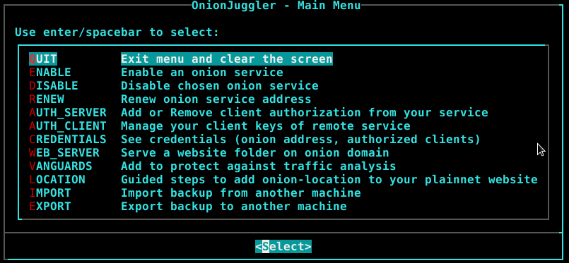
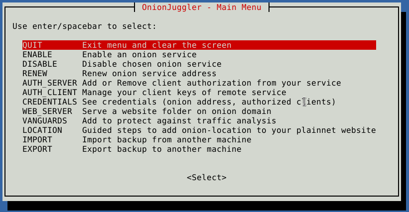
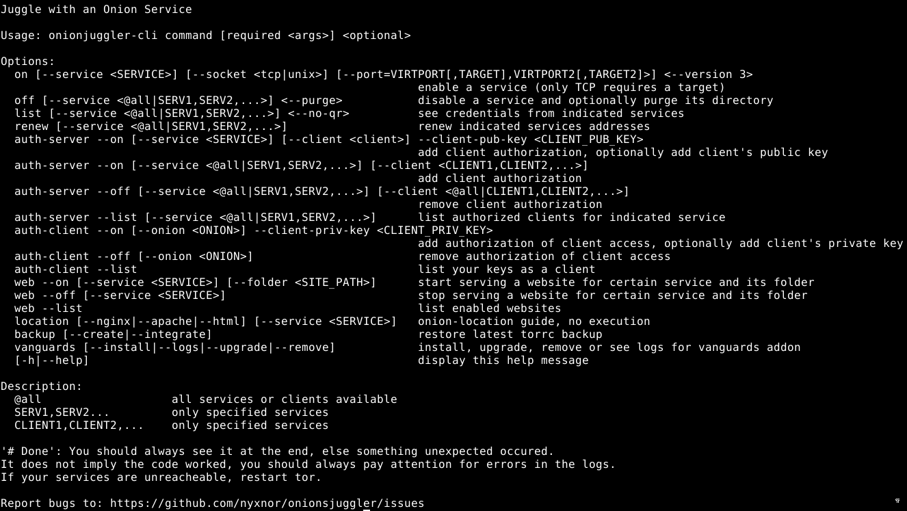

# OnionJuggler
[](https://github.com/nyxnor/onionjuggler/actions/workflows/main.yaml)
[](https://www.codefactor.io/repository/github/nyxnor/onionjuggler/overview/main)
[](https://github.com/nyxnor/onionjuggler/blob/main/LICENSE)
[](https://github.com/nyxnor/onionjuggler/search?l=Shell)
[](https://en.wikipedia.org/wiki/Typewriter)


### Feature-rich Onion Service manager for UNIX-like operating systems written in POSIX conformant shellscript

OnionJuggler is a collection of Onion Services features implemented for Unix-like systems following the Portable Operating System Interface standard.


**WARNING: `do not trust this repo yet`, backup your hs keys in another location. This project has not been released and should be considered for development only.**

Quick link to this repository: https://git.io/onionservice

## Table of Contents

* [Introduction](#introduction)
  * [Images](#images)
  * [Ecosystem](#ecosystem)
  * [Goal](#goal)
  * [Features](#features)
* [Instructions](#instructions)
  * [Setup](#setup)
  * [Clone the repository](#clone-the-repository)
  * [Set custom vars](#set-custom-vars)
  * [Setup the environment](#setup-the-environment)
  * [Usage](#usage)
* [Portability](#portability)
  * [Shells](#shells)
  * [Operating systems](#operating-systems)
  * [Service managers](#service-managers)
  * [Requirements](#requirements)
* [Credits](#credits)
  * [Inspirations](#inspirations)
  * [Contributors](#contributors)

## Introduction

### Images





### Ecosystem

Onion Services are the Hidden Services of Tor which use onion routing as its base for stablishing private connections. [They offer](https://community.torproject.org/onion-services/overview/):
* Location hiding - IP address aren't used, so your location is protected.
* End-to-end authentication - Only the owner of the hs secret key can host the same onion, so no impersonation is possible, no man-in-the-middle.
* End-to-end encryption - Traffic is encrypted from the client to the onion host, no need to trust [CAs](https://en.wikipedia.org/wiki/Certificate_authority) which are a [fallible model](https://www.whonix.org/wiki/Warning#The_Fallible_Certificate_Authority_Model).
* NAT punching - On a firewalled network, no need to open ports

For a deeper understanding, read the [Rendezvous Specification](https://gitweb.torproject.org/torspec.git/tree/rend-spec-v3.txt) and [Tor design](https://svn-archive.torproject.org/svn/projects/design-paper/tor-design.pdf).

Onion Routing tries to solve most of these problems but it is still centralized by the [Directory Authorities](https://metrics.torproject.org/rs.html#search/flag:authority), and referencing [Matt Traudt's blog post](https://matt.traudt.xyz/posts/Debunking:_OSINT_Analysis_of_the_TOR_Foundation/#index4h2): replacing it for something more distributed is [not a trivial task](https://www.freehaven.net/anonbib/#wpes09-dht-attack).

On the Tor ecosystem, from [TPO metrics](https://metrics.torproject.org/), comparing only Free and Open Source Operating Systems, `Linux` dominates on [relays by platform](https://metrics.torproject.org/platforms.html) and [Tor Browser downloads by platform](https://metrics.torproject.org/webstats-tb-platform.html) over BSD. Data regarding which operating system the onion service operator can not be easily acquired for obvious reasons. That was on the network level, but know on the user system, even if one chooses a Free and Open Source Operating System, GNU/Linux dominates a big share over *BSD, having a huge impact on the main software used for the kernel (Linux), shell (bash), service manager (systemd).

### Goal

The goal of this project is:
* facilitates onion service management, from activating a service to adding client authorization to it, giving the full capabilities of editing files manually would have but with less tipying.
* show the that managing the onion service is much more than just using a webserver with your pages.
* distribution, from the source code level (FOSS) to the effect it takes when it allows anyone to run the code on any operating system, shell or service manager. Mitigation from a single point of failure

Descentralization from a single point of failure:
* **Kernel** from predominant `Linux` to also `BSD`.
* **Shell** from predominant `bash` to also any POSIX shell such as `ksh`, `(y,d)ash` and `zsh` (emulating sh).
* **Service manager** from predominant `systemd` to also `OpenRC`.

Editing the tor configuration file (torrc) is not difficult, but automation solves problem of misconfiguration and having:
* less time spent
* complete uniformity
* graphical interface to help newbies

### Features

* [**Enable service**](https://community.torproject.org/onion-services/setup/) - Create directory if not existent (HiddenServiceDir), select onion version (HiddenServiceVersion), custom socket type being unix or tcp, up to two virtual ports, up to two targets (HiddenServicePort).
* **Disable service** - Remove service configuration from the torrc, the service will not be acessible anymore, but you can enable it again any time you want. Optionally purge the service, deleting its configuration and directory, which will delete its keys permanently.
* **Renew service address** - Focused on private onion services, if you ever leak its address, you can change its hostname, beware all of your authorized clients will be disconnected and the service keys will be permanently deleted.
* **Credentials** - Show hostname, clients, torrc block, qrencoded hostname.
* [**Onion authentication**](https://community.torproject.org/onion-services/advanced/client-auth/) - For v3 onion services only. This depends on client and server side configuration and works with a key pair, the client holds the private key part either generate by him (more safe) or given by the service operator and the onion service operator holds the public part. If any if
  * **Server** - Generate key pair or add public part, list client names and their public keys from `<HiddenServiceDir>/authorized_clients/<client>.auth`. If any client is configured, the service will not be acessible without authentication.
  * **Client** - Generate key pair or add public part, list your `<ClientOnionAuthDir>/<SOME_ONION>.auth_private`.
* [**Onion-Location**](https://community.torproject.org/onion-services/advanced/onion-location/) - For public onion services You can redirect your plainnet users to your onion service with this guide for nginx, apache2 and html header attributes.
* **Backup** - Better be safe.
  * **Create** -  Backup of your `torrc` lines containing hidden service configuration, all of your directories of `HiddenServiceDir` and `ClientOnionAuthDir`. Guide to export the backup to a remote host with scp.
  * **Integrate** - Integrate hidden serivces lines configuration from `torrc` and the directories `HiddenServiceDir` and `ClientOnionAuthDir` to your current system. This option should be used after creating a backup and importing to the current host. Guide to import backup to the current host with scp.
* [**OpSec**](https://community.torproject.org/onion-services/advanced/opsec/) - Operation Security
  * [**Vanguards**](https://github.com/mikeperry-tor/vanguards) - This addon protects against guard discovery and related traffic analysis attacks. A guard discovery attack enables an adversary to determine the guard node(s) that are in use by a Tor client and/or Tor onion service. Once the guard node is known, traffic analysis attacks that can deanonymize an onion service (or onion service user) become easier.
  * [**Unix socket**](https://riseup.net/en/security/network-security/tor/onionservices-best-practices) - Support for enabling an onion service over unix socket to avoid localhost bypasses.
* **Web server** - Serve files with your hidden service using Nginx or Apache2 web server.
* **Usability** - There are two dialog boxes compatible with the project, `dialog` and `whiptail`.
* **Bulk** - Some commands can be bulked with `all-clients`, `all-services`, `[SERV1,SERV2,...]` and `[CLIENT1,CLIENT2,...]`, the command will loop the variables and apply the combination.
* **Optional** - Some commands are optional so less typing. Also they may behave differently depending on how much information was given to be executed and that is expected. They are specified inside `<>` (e.g. `<VIRTPORT2>`)
* **Fool-proof** - The script tries its best to filter invalid commands and incorrect syntax. The commands are not difficult but at first sight may scare you. Don't worry, if it is invalid, it won't run to avoid tor daemon failing to reload because of invalid configuration. If an invalid command runs, please open an issue.


## Instructions

### Setup

Three easy steps to fully this project:

#### Clone the repository

```sh
git clone https://github.com/nyxnor/onionjuggler.git
cd onionjuggler
```

#### Set custom vars

Edit the required variables to fit your system inside `.onionrc` following the same format from the already defined variables. Note that no variable that refers to a folder end with a trailing "/". Keep it that way, else it will break. The packages can have different names depending on the operating system, modify accordingly.

Set the default editor of your choice, else it will always fallback to [Vi](https://en.wikipedia.org/wiki/Vi). This is an example using `nano`, but could be any other editor:
```sh
printf "\nexport EDITOR=\"nano\"\n" >> ~/."${SHELL##*/}"rc && . ~/."${SHELL##*/}"rc
```

Open the mentioned configuration file:
```sh
"${EDITOR:-vi}" .onionrc
```
```sh
## [ EDIT REQUIRED ]
privilege_command="sudo" ## [sudo|doas]
tor_user="debian-tor" ## [debian-tor|tor]
tor_service="tor@default.service" ## [tor@default.service|tor.service]
pkg_mngr_install="${privilege_command} apt install -y" ## always use the 'yes' flag to be non interactive
web_server="nginx" ## [nginx|apache2]
dialog_box="dialog" ## [dialog|whiptail]
requirements="tor grep sed openssl basez git qrencode pandoc lynx gzip tar python3-stem ${dialog_box} ${web_server}" ## search pkg name for your OS on docs/COMPATIBILITY.md
```
Edit with sed (use insert option -> `sed -i''`):
```sh
sed "s|tor_user=.*|tor_user=\"tor\"|" .onionrc
```

#### Setup the enviroment

Determine the enviromental variable `${ONIONJUGGLER_PWD}` and add the directory to `${PATH}`.
* add the enviromental variable  to find the repo-> exporting this variable possibilitate calling it from inside shell scripts.
* add directory to path -> call the scripts from any directory as if they were commands (without indicating the path to them or prepending with the shell name).

For this, you have two options:
* **Easy**: run from inside the cloned repository and it will use the same path as in`${PWD}`:
```sh
./install/setup.sh
```
* **Development**:  set the variable manually using the absolute path without trailing "/" at the end. Favorable for integrating into other projects. Run from any directory (need to specify the path)
```sh
./install/setup.sh -s -p /PATH/TO/ONIONJUGGLER/REPO && . ~/."${SHELL##*/}"rc
```

### Usage

The repo is now in your `$PATH`, if you have setup the environment as described above. This means you can call the scripts as if they were any other command.

To create on service, it is as easy as possible:
```sh
onionjuggler-cli on -s terminator
```
But can be as advanced as specifying all the parameters:
```sh
onionjuggler-cli on --service terminator --socket unix --version 3 --port 80
```

#### Scripts

There are some ways to call the scripts, evaluate the advantages and disadvantages:

||Command|Specifying shell|
|-|-------|----------------|
|Advantages|follows the shebang, can be used from any directory|can choose the shell|
|Disadvantages|the scripts must be executable|ignores the shebang, needs to specify path if not in the same directory|
|Syntax|`onionjuggler-cli`|`sh onionjuggler-cli`|

#### Documentation

Take a loot at the documentation inside `docs` folder. Read:

* any markdown file formatted on the shell:
```sh
ls docs/*.md
pandoc "${ONIONJUGGLER_PWD}"/docs/CONTRIBUTING.md | lynx -stdin
```

* the [manual](docs/ONIONJUGGLER-CLI.md) for advanced usage:
```sh
man onionjuggler-cli
```

## Portability

### Shells

Full compatibility with any POSIX compliant shells: dash, bash, ksh, mksh, yash, ash

The default POSIX shell of your unix-like operating system may vary depending on your system (FreeBSD and NetBSD uses `ash`, OpenBSD uses `ksh`, Debian uses `dash`), but it has a symbolic link leading to it on `/usr/bin/sh` and/or `/bin/sh`.

Tweak to be compatible with non-POSIX compliant shells::
* Z SHell (zsh) -> `zsh --emulate sh -c onionjuggler-tui`

### Operating systems

Works unix-like operating systems, tested by the maintainer mostly on GNU/Linux Debian 11.
Work is being done for *bsd systems, sed is using [this trick](https://unix.stackexchange.com/a/401928).

### Service managers

Currently only systemd is available, planning on implementing SysV, Runit, OpenRC.

### Requirements

* General:
  * Unix-like system.
  * any POSIX shells: `dash` 0.5.4+, `bash` 2.03+, `ksh` 88+, `mksh` R28+, `zsh` 3.1.9+, `yash` 2.29+, busybox `ash` 1.1.3+ etc.
  * systemd (for tor and vanguards control) - for now, different services managers is a goal
  * superuser privileges to call some commands as root and the tor user, with `doas` or `sudo`.
  * blank lines between Hidden Services blocks in the torrc.
  * HiddenServiceDir different path than DataDir - `DataDir/services`.
  * Path for folders variables must not contain trainling "/" at the end of the variables on `.onionrc` (Incorrect: `~/onionjuggler/`, Correct: `~/onionjuggler`).

* Packages:
  * **doas/sudo** (must be already configured)
  * **tor** >= 0.3.5
  * **grep** >=2.0
  * **sed** >= 2.0
  * **python3-stem** >=1.8.0
  * **openssl** >= 1.1
  * **basez** >= 1.6.2
  * **git** >= 2.0
  * **qrencode** >= 4.1.1
  * **pandoc**
  * **lynx**
  * **tar**
  * **gzip**
  * **nginx/apache**

The packages are downloaded when setting up the environment with [setup.sh](install/setup.sh), the packages that are requirements are specified on [.onionrc](.onionrc).
The absolute minimum you can go to is `doas/sudo tor grep sed`, and you will be limited to enable, disable and renew services.
It is expected that you already have your user in the "${privilege_command}"ers configuration file.

## Credits

### Inspirations

These are projects that inspires OnionJuggler development, each with their own unique characteristic.

* [OnionShare CLI](https://github.com/onionshare/onionshare/tree/develop/cli) possibilitates ephemeral onion services that never touch the disk and can be run on Tails or Whonix easily. It provides onion authentication, focusing on running servers to send and receive files, chat and host a static website. OnionJuggler evolved by watching the sharing capabilities of OnionShare and converting them to shellscript.

* [RaspiBlitz](https://github.com/rootzoll/raspiblitz/blob/v1.7/home.admin/config.scripts/internet.hiddenservice.sh) provides a ton of bitcoin related services that can be run over tor, so onion services is the choice to access your node from outside LAN. OnionJuggler started by forking Blitz script to remove hardcoded paths.

* [TorBox](https://github.com/radio24/TorBox) is an easy to use, anonymizing router that creates a separate WiFi that routes the encrypted network data over the Tor network. It also helps configuring bridges and other countermeasures to bypass censorship. OnionJuggler aims to help people on surveillance countries to communicate privately.

### Contributors

[](https://github.com/nyxnor/onionjuggler/graphs/contributors)
