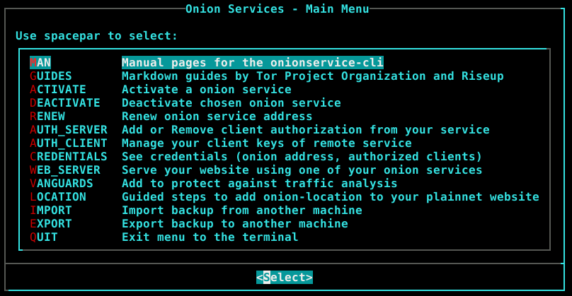

# onionservice

### An easy to use Onion Service manager

**WARNING: `do not trust this repo yet`, backup your hs keys in another location**


## Analysis

The current state of the internet (plain net) is:
* **not private** - every server you connect to knows your public ip address and your Internet Service Provider knows to which site you are connecting to.
* **not trustless** - to add encryption to an website, there is the [Certificate Authority](https://en.wikipedia.org/wiki/Certificate_authority) problem, the conglomerate dictates. Your Let's Encrypt self signed certificates is not the solution if noone verifies the fingerprint.
* **not censorship resistant** - dns attacks as well as many other still occurs
* **not descentralized** - you can not purely peer to peer (running your own internet, connecting directly to the wanted host)

Onion Routing tries to solve most of these problems but it is still centralized by the [Directory Authorities](https://metrics.torproject.org/rs.html#search/flag:authority), and referencing [Matt Traudt's blog post](https://matt.traudt.xyz/posts/Debunking:_OSINT_Analysis_of_the_TOR_Foundation/#index4h2): replacing it for something more distributed is [not a trivial task](https://www.freehaven.net/anonbib/#wpes09-dht-attack).

On the Tor echosystem, from [TPO metrics](https://metrics.torproject.org/), comparing only Free and Open Source Operating Systems, `Linux` dominates [on relays by platform](https://metrics.torproject.org/platforms.html) and [Tor Browser downloads by platform](https://metrics.torproject.org/webstats-tb-platform.html) over BSD. Data regarding which operating system the onion service operator can not be easily acquired for obvious reasons.

That was on the network level, but know on the user system, even if one chooses a Free and Open Source Operating System, GNU/Linux dominates a big share over *BSD, having a huge impact on the main software used for the kernel (Linux), shell (bash), service manager (systemd).


## Goal

The goal of this project:
* facilitate onion service management, from activating a service to adding client authorization to it, giving the full capabilities of editing files manually would have but with less tipying.
* show the that managing the onion service is much more than just using a webserver with your pages.
* distribution, from the source code level (FOSS) to the effect it takes when it allows anyone to run the code on any operating system, shell or service manager.

Descentralization from a single point of failure:
* **Kernel** from predominant `Linux` to also `BSD`.
* **Shell** from predominant `bash` to also any POSIX shell such as `ksh`, `(y,d)ash` and `zsh` (emulating sh).
* **Service manager** from predominant `systemd` to also `Runit`, `OpenRC`.

Editing the tor configuration file (torrc) is not difficult, but automation solves problem of misconfiguration and having:
* less time spent
* complete uniformity

## Features

* **Enable service** - Create directory if not existent, enable with custom socket type (unix or tcp) virtual port, target (localhost or remote).
* **Disable service** - Remove service configuration from the torrc, the service will not be acessible anymore, but you can enable it again any time you want. Optionally purge the service, deleting its configuration and directory, which will delete its keys permanently.
* **Renew service address** - Focused on private onion services, if you ever leak its address, you can change its hostname, beware all of your authorized clients will be disconnected and the service keys will be permanently deleted.
* **Credentials** - Show hostname, clients, torrc block, qrencoded hostname.
* **Onion authentication** - For v3 onion services only. This depends on client and server side configuration and works with a key pair, the client holds the private key part either generate by him (more safe) or given by the service operator and the onion service operator holds the public part. If any if
  * **Server** - Generate key pair or add public part, list client names and their public keys from `<HiddenServiceDir>/authorized_clients/<client>.auth`. If any client is configured, the service will not be acessible without authentication.
  * **Client** - Generate key pair or add public part, list your `<ClientOnionAuthDir>/<SOME_ONION>.auth_private`.
* **Onion-Location** - For public onion services You can redirect your plainnet users to your onion service with this guide for nginx, apache2 and html header attributes.
* **Backup** - Better be safe.
  * **Create** -  Backup of your `torrc` lines containing hidden service configuration, all of your directories of `HiddenServiceDir` and `ClientOnionAuthDir`. Guide to export the backup to a remote host with scp.
  * **Integrate** - Integrate hidden serivces lines configuration from `torrc` and the directories `HiddenServiceDir` and `ClientOnionAuthDir` to your current system. This option should be used after creating a backup and importing to the current host. Guide to import backup to the current host with scp.
* **Vanguards** - This addon protects against guard discovery and related traffic analysis attacks. A guard discovery attack enables an adversary to determine the guard node(s) that are in use by a Tor client and/or Tor onion service. Once the guard node is known, traffic analysis attacks that can deanonymize an onion service (or onion service user) become easier.
* **Web server** - Serve files with your hidden service using Nginx or Apache2 web server.
* **Bulk** - Some commands can be bulked with `all-clients`, `all-services`, `[SERV1,SERV2,...]` and `[CLIENT1,CLIENT2,...]`, the command will loop the variables and apply the combination.
* **Optional** - Some commands are optional so less typing. Also they may behave differently depending on how much information was given to be executed and that is expected. They are specified inside `<>` (e.g. `<VIRTPORT2>`)
* **Fool-proof** - The script tries its best to filter invalid commands and incorrect syntax. The commands are not difficult but at first sight may scare you. Don't worry, if it is invalid, it won't run to avoid tor daemon failing to reload because of invalid configuration. If an invalid command runs, please open an issue.


## Images




## Instructions

### Setup

Three easy steps to fully this project:

1. Clone the repository:
```sh
git clone https://github.com/nyxnor/onionservice.git
cd onionservice
```

2. Edit the required variables to fit your system inside `.onionrc`. Open the mentioned file with any editor:
```sh
"${EDITOR:-nano}" .onionrc
```
```sh
## [ EDIT REQUIRED IF NOT DEBIAN ]
PKG_MANAGER_INSTALL="sudo apt install -y" ## always use the 'yes' flag to be non interactive
WEBSERVER="nginx" ## [nginx|apache2]
TOR_USER="debian-tor" ## [debian-tor|tor]
TOR_SERVICE="tor@default.service" ## [tor@default.service|tor.service]
```

3. Setup the enviroment:
```sh
sh setup.sh
```


#### Usage

Take a loot at the documentation inside `docs` folder.

Call the TUI
```sh
sh onionservice-tui
```

Call the CLI
```sh
sh onionservice-cli
```

Restore the latest torrc backup:
```sh
sh onionservice-cli setup torrc
```

The repository is in your path (set by `setup.sh`). Call `onionservice-cli` as a command from any directory you are without prepending with the shell name. Go to any folder and call the `cli`:
```sh
cd
onionservice-cli
onionservice-tui
```

Read:

* any markdown file formatted on the shell (with `pandoc` and `lynx`):
```sh
ls docs/*.md
pandoc docs/CONTRIBUTING.md | lynx -stdin
```

* the [CLI manual](docs/ONIONSERVICE-CLI.md):
```sh
man onionservice-cli
```


## Portability

### Requirements

* Unix-like system
* tor >= 0.3.5 (HiddenServiceVersion 3 for onion authentication)
* grep
* sed
* python3-stem >=1.8.0 (for Vanguards)
* openssl >= 1.1+ (for onion authentication)
* basez >= 1.6.2 (for onion authentication)
* git >= 2.0+ (for cloning the repo and vanguards)
* qrencode >= 4.1.1 (for printing the hostname)
* pandoc (creating the manual and reading markdown)
* lynx (reading markdown)
* systemd (for vanguards control) - for now, different services managers is a goal
* user with root privileges
* leave blank lines between Hidden Services torrc lines - the cli script create it correctly, no change needed when using this project, just be aware when editing your torrc or importing your torrc and deactivating a service, it will delete every line within the same block
* HiddenServiceDir different root path than DataDir (facilitates a lot backup and other detections, else would need to prefix every HiddenServiceDir with hs_*)
* Path for folders variables must not contain "/" at the end.

### Operating systems

Works unix-like operating systems, tested by the maintainer specifically on GNU/Linux Debian 11.
Work is being done for *bsd systems, sed is using [this trick](https://unix.stackexchange.com/a/401928). Missing different service managers, currently just supports Systemd, planning on implementing SysV, Runit, OpenRC.

### Shells

Full compatibility with the following shells:
* Korn Shell (ksh)
* (Debian) Alquimist SHell (ash, dash)
* Yet Another SHell (yash)
* Bourne-Again SHell (bash)
* Z SHell (zsh)

#### Which shell to use?

The best performance (most reliant, fastest and lightweight) you can get using these script is calling them with `sh` (not an actual shell, `/bin/sh` is symlinked to the distribution choice of POSIX compliant shell. FreeBSD and NetBSD uses `ash`, OpenBSD uses `ksh`,Debian uses `dash`:
`ls -l /bin/sh`: `/bin/sh -> dash`.

You may call the scripts with the the POSIX compliant shell of your system by using only `sh`:
```sh
sh onionservice-cli
```

#### Zsh in `sh` compatibility

The Z SHell is not POSIX compliant (works with the CLI but need workarounds when using the TUI). You can run the TUI:

* with the Z Shell emulating a POSIX shell:
```sh
zsh --emulate sh -c onionservice-tui
```

* calling the shell specifying its path:
```sh
/bin/sh -c onionservice-tui
```

## Bugs

* There are no accidents - Master Oogway
* Bugs, you may find - Master Yoda
* It is the program that should fear your commands and not the other way around - Mix of Pai Mei with Richard M. Stallman
* Please report the bug, open an issue with enough description to reproduce the steps and solve the problem.

## To-do

* improve backup method
* [getopts](https://pubs.opengroup.org/onlinepubs/9699919799/utilities/getopts.html)
* support for different services managers
* Bash completion [official package](https://github.com/scop/bash-completion/) and [debian guide](http://web.archive.org/web/20200507173259/https://debian-administration.org/article/317/An_introduction_to_bash_completion_part_2)
* [Whonix HS Guide](https://www.whonix.org/wiki/Onion_Services#Security_Recommendations). Important: This is not whonix and whonix is more secure as it has different access control over workstation and gateway, use that for maximum security and anonymity. This is just to get the best I can and implement it. Also, Whonix-anon is no Tails, check it out too.
